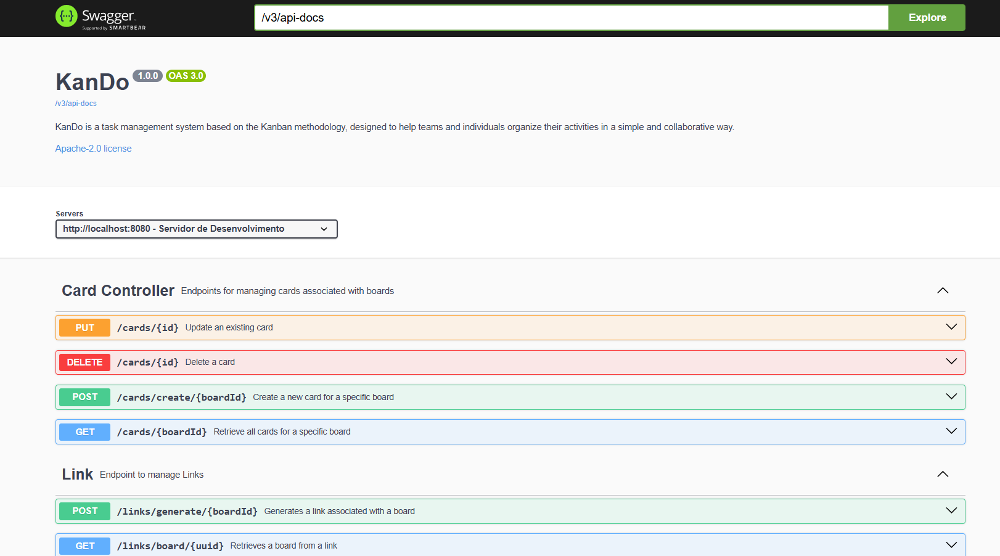

<h1 align="center">
  
</br>
  KanDo - Backend

  
</h1>

Api de gerenciamento de quadro colaborativo. Ele permite que os usuários criem quadros, gerenciem cartões dentro de quadros, compartilhem quadros por meio de links e interajam com outros usuários vinculados a esses quadros.


## 🛠️ Tecnologias Utilizadas:
- **Spring Boot 🐉**:
  - Web, JPA, Security, Validation, OAuth2 Client
    
- **Banco de dados 🗄️**:
  -  

- **Segurança 🔒**:
  - 

- **Documentação da API 📄**:
  - 

- **Mapeamento 🗺️**:
  - 

 
## 📚 Endpoints

#### **User 👤**
- **GET /user**: Recupera informações do usuário autenticadas por meio do Google OAuth2

#### **Board Endpoints 📋**
- **POST /boards/create-board**: Cria um novo quadro
- **GET /boards**: Recupera todos os quadros do usuário autenticado
- **GET /boards/{id}**: Obtêm um quadro por id
- **DELETE /boards/delete/{id}**: Exclui um quadro
  
#### **Card Endpoints 📝**
- **PUT /cards/{id}**: Atualiza a tarefa
- **DELETE /cards/{id}**: Exclui uma nova tarefa
- **POST /cards/create/boardId**: Cria uma nova tarefa no quadro
- **GET /cards/{boardId}**: Recupera as tarefas com base no id do quadro

#### **Link Endpoints 🔗**
- **POST /links/generate/{boardId}**: Gera um link para um quadro para permitir o acesso de outros usuários
- **GET /links/board/{uuid}**: Recupera um quadro usando o link gerado
 
#### **Board User Link Endpoints 📍**
- **GET /board-users/{boardId}**: Obtêm todos os usuários que acessaram aquele quadro
- **DELETE /board-users/{id}**: Remove um link de um usuário para um quadro


## 📖 Documentação

A API utiliza Swagger para documentar os endpoints de forma interativa.
<div align="center">
  
</div>


## 🗂️ Estrutura do Projeto

O projeto está organizado da seguinte forma:
```
src/
├── main/
│   ├── java/
│   │   ├── com/
│   │   │   ├── carolina/
│   │   │   │   ├── backend/
│   │   │   │   │   ├── configs/        # Configurações (ex: SwaggerConfig, CorsConfig e SecurityConfig)
│   │   │   │   │   ├── controllers/    # Controladores de API
│   │   │   │   │   ├── dtos/           # Objetos de transferência de dados
│   │   │   │   │   ├── enums/          # Enum com a opção de Status
│   │   │   │   │   ├── exceptions/     # Exceções personalizadas
│   │   │   │   │   ├── mappers/        # Mapeamento entre DTOs e entidades
│   │   │   │   │   ├── model/          # Entidades
│   │   │   │   │   ├── repositories/   # Para acesso a dados
│   │   │   │   │   ├── services/       # Lógica de negócios
```


## 🛠️ Como Rodar o Projeto

1. Clone o repositório:

```

https://github.com/Francine02/KanDo.git

cd backend

```

2. Configure o application.yml para credenciais do Google OAuth2 e banco de dados PostgreSQL.

3. Compile e rode o projeto.

4. Acesse a API em  [http://localhost:8080/swagger-ui/index.html#](http://localhost:8080/swagger-ui/index.html#)


## 🤝 Contribuindo
1. Faça um fork deste repositório.
2. Crie uma branch para a sua feature (git checkout -b feature-nome-da-feature).
3. Faça o commit das suas alterações (git commit -m 'Adiciona nova feature').
4. Envie para o repositório remoto (git push origin feature-nome-da-feature).
5. Crie um novo Pull Request.

#### Obs.:
- Por favor, siga as convenções de commits do projeto.
- Certifique-se de que o código esteja bem documentado antes de enviar o PR.

## 📝 Licença

Este projeto está licenciado sob a **Apache-2.0 license**. Para mais detalhes, consulte o arquivo [LICENSE](LICENSE). A licença Apache permite que você use, modifique e distribua este projeto, desde que você siga as condições estabelecidas.
